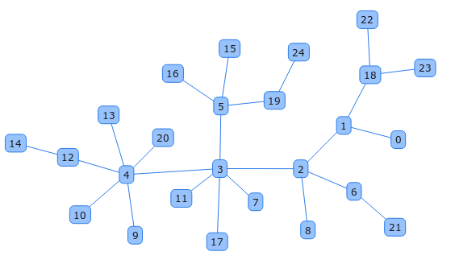

# Network

Links Network is an interactive chart to visualize networks. 
It allows creating nodes, links between the nodes, and interactive packages 
moving between nodes. Interaction can be real time or can be animated from a set 
of historical data. The visualization supports custom styles, colors, sizes, images, and more.

## Javascript {#javascript}

### Downloads

loading...

### Documentation

- [Overview](js/network/doc)
- [API](js/network/doc/jsdoc)

### Examples

loading...

## Google Web Toolkit {#gwt}

### Downloads

loading...

### Documentation

- [Overview](gwt/gwt-links-network/doc)
- [API](gwt/gwt-links-network/doc/javadoc)

### Examples

loading...

