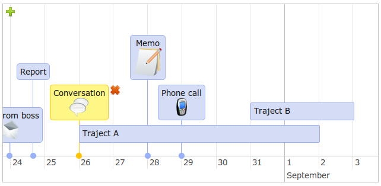

# Timeline

The Timeline is an interactive visualization chart to visualize events in time. 
The events can take place on a single date, or have a start and end date (a range). 
You can freely move and zoom in the timeline by dragging and scrolling in the Timeline. 
Events can be created, edited, and deleted in the timeline. 
The time scale on the axis is adjusted automatically, and supports scales ranging from milliseconds to years.

## Javascript {#javascript}

### Downloads

loading...

### Examples

loading...

### Documentation

- [Overview](js/timeline/doc)
- [API](js/timeline/doc/jsdoc)

## Google Web Toolkit {#gwt}

### Downloads

loading...

### Examples

loading...

### Documentation

- [Overview](gwt/gwt-links-timeline/doc)
- [API](gwt/gwt-links-timeline/doc/javadoc)
